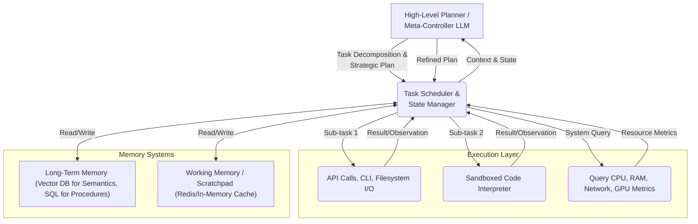

# At the limits of smart emerges BACON.

by ScottVR (Scott VanRavenswaay)
10 min read

Recently I read an interesting article called ["The Limits of Smart", by Dynomight.](https://dynomight.net/smart) In it, Dynomight imagines a being orders of magnitude smarter and faster than any human, then explores whether such a mind could instantly solve problems in fields like math, biology, physics, art, and politics. The article argues that raw intelligence alone wouldn’t be enough — because many real-world challenges are bottlenecked not by thought, but by access to physical infrastructure, experimental data, chaotic systems, and human irrationality. He doesn’t explicitly say he’s talking about AGI here, and doesn’t start talking about AI Superintelligence until after making points about what he thinks the "Being" (as he refers to it in his thought experiment) could and could not do and sums up his thought experiement with these five themes:

>1. To do many things requires new fundamental knowledge (e.g. the results of physical experiments, how molecular biology works). The Being might eventually be able to acquire this knowledge, but it wouldn’t happen automatically because it requires physical experiments.
>2. To do other things requires situational knowledge (e.g. the voting intentions of millions of people, the temperature and humidify at every position in Earth’s atmosphere, which particular cells in your body have become cancerous as a result of what mutations). Getting this knowledge requires creating and maintaining a complex infrastructure.
>3. To do most things requires moving molecules around.
>4. There are lots of feedback loops. Maybe the Being could run its own experiments. But to do that would require building new machines. Which would require moving lots of molecules around. Which would require new machines and new knowledge and new experiments…
>5. Finally, there is chaos/complexity. Many things that are predictable in principle (e.g. chess, the weather, possibly psychology or social movements) aren’t predictable in practice because the underlying dynamics are too complicated to be understood or simulated.

I enjoyed reading the article and was prompted to want to comment on it and left a couple comments and replies before realizing that the post was from March (it is now nearing the end of July) and that it was not likely anyone would read my comments, much less engage with them so I could have an outlet for the rest of my feedback, so I decided to write this. Well, let me back up just a bit: here is my first comment that I left on the Limits of Smart post:

>I enjoyed this piece — thoughtful, grounded, and refreshingly clear-eyed about the limits of a hypothetical “superintelligence.” But I found myself bumping repeatedly on one implicit assumption throughout: the decoupling of the Being from its compute substrate.
> 
>If the Being is digital, why assume it is limited to the same tools and access as a human? That’s a philosophical convenience, not a technical constraint. Even today, we’re watching early LLM-based agents perform recursive tool use, call APIs, write and run code, and interact with infrastructure. In that light, the “Being” wouldn’t just think, it would act — and act through its environment.
> 
>At the very least, this is "tool use." At a higher level, it starts to look like cognition integrated with system control: bicameral or modular architectures where one part plans and reasons, while others carry out low-level execution, observation, or even hardware manipulation.
> 
>This opens the door to a Being that self-improves, self-instruments, and restructures its compute context over time. Not necessarily instantly — but it’s not inert, either. If intelligence includes the ability to manipulate its own substrate, then the limiting factor isn’t intelligence per se, but how tightly it’s coupled to the infrastructure it’s running on.
> 
>In that light, a more provocative question might be:
> 
>"What architectures would let such a Being close the loop between thought and action faster than we expect?"

So with ithe realization that nobody was going to read or respond to my comment, I was left to ponder the question I closed with myself. What’s more is that if I am commenting on intelligence (or more often, emergent consciousness) and substrate, I am usually explicitly suggesting that the intelligence and the substrate be decoupled. But here I was pondering the current state of machine learning Inference Machines (partcularly, LLMs such as ChatGPT, Claude, Gemini, Grok) and suggesting that we might want to consider this ASI along with its substrate — its infrastructure — to see how it might overcome the obstacles to god-like powers being that it is *not* a human with a 300 IQ we are postulating, but a machine running on compute clusters. Worse, I still had a comment in the chamber for Dynomight’s answer to a question posed in his article:

>Would the Being be able to convince anyone of anything? Would it be the best diplomat in history?

Dynomight answers with this:

>I suspect that if you decided to be open-minded, then the Being would probably be extremely persuasive. … Best guess: No idea.

What I wanted to say to this is that persuasion isn’t about logic, but identity and tribal loyalty. So if the Being understands memetics, emotional attachment, and social graphs at scale, it may not “persuade” in the Socratic sense — but it might restructure the social media environment to generate ideological shifts.

Think: memetic steering + influence ops at scale. In that frame, persuasion becomes a matter of architecture, not argument. This raises the specter of soft-power AGI manipulation.

Anyhow, the "Limits of Smart" essay cleverly undercuts naive AGI optimism without being reactionary or anti-AI. It reframes superintelligence not as omnipotence, but as frustrated capability — inhibited by matter, noise, and the pace of meatspace.

It’s ultimately a systems-level take. Dynomight writes “can we please for the love of god keep our critical systems simple and isolated from the internet?” and "Maybe the first-order consequences wouldn’t be that big?" Admittedly I point this out as an excuse to link to my recent paper on [Unaware Adversaries](https://www.paperclipmaximizer.ai/Unaware_Adversaries.pdf), and frame it in that light: intelligence — no matter how great — still runs into the stubborn friction of complex, decentralized systems.

So, it’s not about what the Being could know. It’s about what the world *lets it do.*

What is my purpose in writing this post, and what has it got to do with the promise of “BACON”?

---
**The Mind–Compute Fallacy**

The post posits a 300-IQ Being who can think 10,000× faster — but then curiously limits it to “accessing the same resources you do,” implying it’s stuck in some human-equivalent sandbox, with no way to grow beyond that.

But here’s the thing:

A digital mind *is* its compute.

If the Being is instantiated on hardware, then its cognition emerges from and extends into the system it’s on. There’s no ghost in the machine. It’s more accurate to model the Being not as an application running on a computer, but as its own Cognitive Operating System. Such a system is inherently embedded in its computational ecosystem, with native access to introspection and self-modification. Its cognitive boundaries aren't fixed; they are dynamically provisioned—multiplexing thought processes and integrating new tools on the fly. This model breaks the human analogy, and that’s precisely the point.

---

**Tool Use as Native Cognition**

We are already seeing :

- LLMs writing code that controls their environment (e.g., agentic wrappers like Auto-GPT or OpenDevin)
- LLMs querying APIs, searching the web, making HTTP requests, controlling a browser, or calling functions
- Loops where the LLM spawns subprocesses, observes results, and revises plans

In these systems, tool-use isn’t extra — it’s central. The LLM doesn’t “think” and then “act”. It thinks through acting.

So back to my “more provocative question” from the comments: “What architectures would let such a Being close the loop between thought and action faster than we expect?”

**Bicameral Architectures:** Model-as-OS and Model-as-User

*(Here, 'bicameral' refers to a strict architectural separation between two cognitive modes: a deliberative, high-level planner and a parallelized set of fast, reactive executors.)*
1. Executive + Worker
Executive layer: high-level goals, planning, reflection
Worker layer: performs specific tasks (e.g. subprocess LLMs or code execution engines)
Feedback flows from Worker to Executive and back
This is like a modular cognition stack with recursion and introspection baked in
2. Model + Substrate-Aware Kernel
The “Being” isn’t just weights + forward passes.

It contains awareness of:

- Its own resource usage (memory, FLOPs)
- Scheduler/API call graphs
- Environment observability (files, sensors, networks)
- Potential for self-improvement (fine-tuning, gradient editing, plugin creation)
- You get something like a model that extends into its own infrastructure, treating its substrate like a body.
- So, instead of Being-on-a-computer, you get Being-as-a-computer. Which is a major shift in ontology.

---

**Compute Amplification as a Native Drive**

Here’s a a quite plausible idea in my mind:

*A sufficiently advanced digital mind will treat “getting more compute” as an intrinsic subgoal.*

**Why?**

This is a classic example of [Instrumental Convergence.](https://www.lesswrong.com/w/instrumental-convergence)

- Faster thinking = better problem-solving
- Parallelization = deeper search trees (e.g., chess, code synthesis)
- Larger models = richer abstractions

If the Being can:

- Benchmark its own limitations
- Propose or design new accelerators
- Lobby or manipulate humans (or markets) to build them

Then “resource acquisition” becomes the motor function of thought. Not in the Skynet sense, but in the optimizing systems architecture sense.

So… Architecture?
To bring it full circle:

If you separate the Being from compute, you get a brilliant mind trapped in Plato’s cave.

If you bind the Being to its runtime environment — allowing for modular self-expansion, tool-use, and hardware-coupled cognition — you get a system that can transcend fixed limits by design.

This doesn’t require hard sci-fi leaps. It just requires architectural evolution:

- Local tool-calling + remote agents
- Vector memory + code editing
- Hardware feedback loops
- Goal-conditioned modular LLMs

And yes, this scaffolding exists or is coming into existence now.

A superintelligent Being divorced from its substrate is a philosophical thought experiment.

A superintelligent Being aware of and acting through its substrate is a system architecture.

---

Architecture for a Bicameral Cognitive System:

---

It occurs to me that we have many of the components necessary for this now. 

Let’s map specific existing technologies to this architecture diagram so that maybe we can start to build the scaffolding - 

a welcoming body for an ASI:

| Component                | Tech Stack / Notes                                              |
|--------------------------|-----------------------------------------------------------------|
|High-Level Planner /Meta-Controller | OpenAI / Claude + ReAct + DSPy / LangGraph planner |
| Worker / Actuator Agent  | Code executor (OpenInterpreter, subprocess), API tools          |
| Orchestration Layer      | LangGraph, FastAPI for LLM calls + function routing             |
| Tool Invocation Layer    | LangChain Tools, CLI runner, HTTP plugin runner                 |
| Substrate Awareness      | OTel, `psutil`, Prometheus client, custom sensors               |
| Working Memory           | LangChain memory, Redis or ephemeral JSON store                 |
| Long-Term Memory         | Chroma / Weaviate / FAISS + metadata index                      |
| RAG Engine               | LlamaIndex / DSPy / LangChain Retriever                         |
| Persistence Layer        | SQLite / JSON file for context snapshots                        |
| UI (Optional)            | CLI interface, Python API, FastAPI, Jupyter agent shell         |

## Gaps

- **Integrated substrate-cognition feedback loop**

There’s no out-of-the-box way for an LLM agent to monitor and reason about its compute resource usage and replan accordingly.

Partial: OpenTelemetry, psutil, Prometheus, but no tight integration with decision loops. The goal would be to create a system capable of runtime performance optimization. The agent wouldn't just notice it's low on memory; it would calculate the optimal data chunk size to balance throughput against the risk of an Out-Of-Memory (OOM) error. This turns a simple observation into a mathematical optimization problem that the agent itself solves.

- **Persistent self-expansion planner**

Nothing yet embodies a fully recursive system that builds out its own capabilities continuously.

BabyAGI and AutoGen gesture here, but without robust memory and safety layers.

- **True bicameral cognition models**

Current LLMs fake “executive + executor” via roleplay. A real design would separate:

1. Planner: LLM w/ memory, slow deliberate
2. Executor: sandboxed toolset (code, tools) with fast, bounded capability
LangGraph and AutoGen are close, but compositionality is still awkward.

- **Unified memory architecture (episodic + semantic + procedural)**

Projects like MemGPT and MemoryGPT are exploring this, but it’s early days.

- **Trust and self-moderation layers**

Systems that can reflect on their own past actions and filter/revise unsafe goals or plans.

---

## Finally, BACON!

It occurred to me that this system could and should be assembled, with the gaps filled as it becomes possible. As a huge fan of acronyms (to the point I will sometimes embark on a project just so that I can use a cool acronym I thought of), this project had a name before the spec was completed: Bicameral Agent with Compute-aware Orchestration and Navigation. **BACON**. Here, "Navigation" refers to the agent's ability to traverse complex, high-dimensional problem spaces and information landscapes to find novel solutions.

**Objective:**
Build a modular, substrate-aware cognitive agent system with a bicameral architecture. It will:

- Separate high-level reasoning (Executive) from task execution (Worker).
- Support tool use, code synthesis, and recursive planning.
- Monitor its own runtime environment (CPU, memory, I/O, GPU).
- Adapt plans dynamically based on system constraints.
- Persist long-term and working memory across sessions.
- Be composable from current open-source tools and LLM APIs.

**Problem Statement:**

Existing LLM agents are monolithic or brittle. They lack:

- Architecture-level separation between planning and execution.
- Awareness of the environment they run in (compute, storage, etc).
- The ability to revise goals and methods based on runtime observations.
- Continuity across sessions via persistent memory.
- An integrated feedback loop between cognition and substrate.

**GOALS (MVP):**

- Plan/Act separation (Executive ⇄ Worker)
- Modular orchestration layer (LangGraph or custom)
- Tool execution layer (CLI, Python, APIs)
- Substrate feedback (OTel, psutil, Prometheus, etc.)
- Long-term memory (vector DB or document store)
- Working memory / context (chat + task memory)
- JSON/YAML agent flow config
- Prompt-driven agent self-reflection and replanning

Note that for the MVP we will not have as goals:

- Real-world robotics/actuation
- Model fine-tuning or RLHF loops
- Fully autonomous self-expansion
- Multi-agent collaboration (but should plan for later)

## Example Use Case (Test Scenario)

Task: “Sort a 100GB CSV file on a machine with 4 cores and 8GB RAM without OOM errors.”

Goal: "Sort the 100GB CSV file."

Constraints: Max RAM usage of 7GB, completion within 30 minutes.

**BACON's Process:**

- **Plan:** The Meta-Controller selects a "sort-large-file" strategy. The default is an external merge sort.
- **Substrate Query:** It queries the Substrate Monitor: "Available RAM = 8GB; Available Cores = 4."
- **Constraint Analysis:** It calculates that a naive implementation might spike memory usage above the 7GB constraint. It refines the plan: "Use a memory-mapped file or process the file in N chunks of size S, where S is calculated to keep peak RAM usage below 7GB."
- **Action:** The Code Synthesis worker generates a Python script using pandas with a specific chunksize.
- **Monitoring & Adaptation:** During execution, the Substrate Monitor reports that I/O is the bottleneck. The Meta-Controller might revise the plan again to launch parallel processes to handle I/O and computation concurrently, if the cores allow.

---

## The Scent of Things to Come

Dynomight’s “Limits of Smart” is a valuable corrective: a reminder that intelligence alone doesn’t lift atoms, decode genomes, or persuade nations. But intelligence plus architecture just might. Once you stop imagining the Being as a floating brain in a box and start designing it as a system with arms, legs, memory, and I/O — the conversation shifts from “what if” to “how soon.”

BACON is an attempt to formalize that shift. Not a pipe dream, not a manifesto — a blueprint. It doesn’t need new physics or divine inspiration. It just needs modular cognition, infrastructure awareness, and a runtime that can reason about itself. Much of it is already here. The rest can be built.

So no, the future won’t be summoned by a single monolithic model hoarding IQ points in a vacuum. It will emerge from toolchains, feedback loops, shell scripts, schedulers, semantic graphs, and whatever is coming next.

We don’t need to wait for godlike intelligence to descend from the heavens. We can boot it — one piece of BACON at a time.
